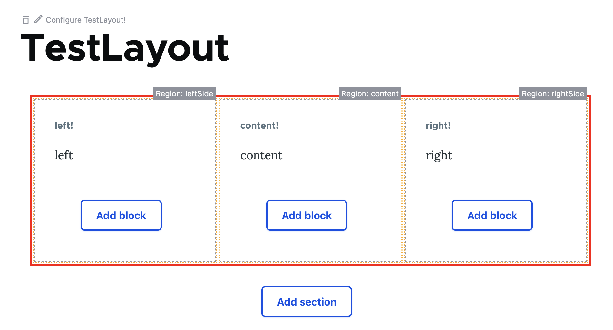

Example of generating layouts based on generic data analysed by [good-php/reflection](https://github.com/good-php/reflection)

The code within produces a Layout Builder layout, which in the editor appears as:

